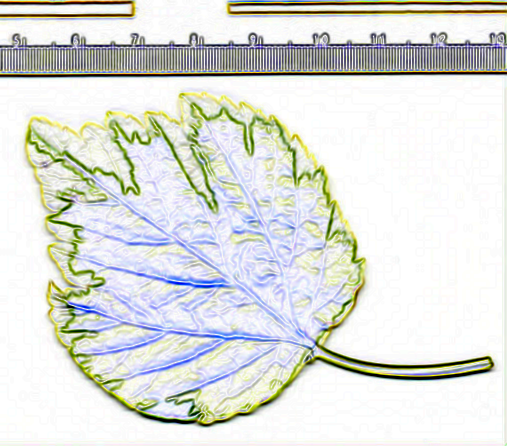

# Exercise 01.04 - Recording macros

Aims:  
- use the macro-recorder to record commands applied to an image
- run the recorded commands on another image

Open the "clown" sample image from the menu `File>Open>Samples>Clown`.

Run the macro-recorder from the menu `Plugins>Macro>Record...`.
Run the following commands from the ImageJ menus:
- `Process>Smooth`,
- `Process>Find Edges`,
- `Edit>Invert`.

Copy the recorded commands from the macro recorder and paste 
them below, close the clown image, open another image and run the macro.

Your code starts after this line

```java
run("Smooth");
run("Find Edges");
run("Invert");
```
<a href="image_1619369454554.png"></a>

Your code ends before this line 

