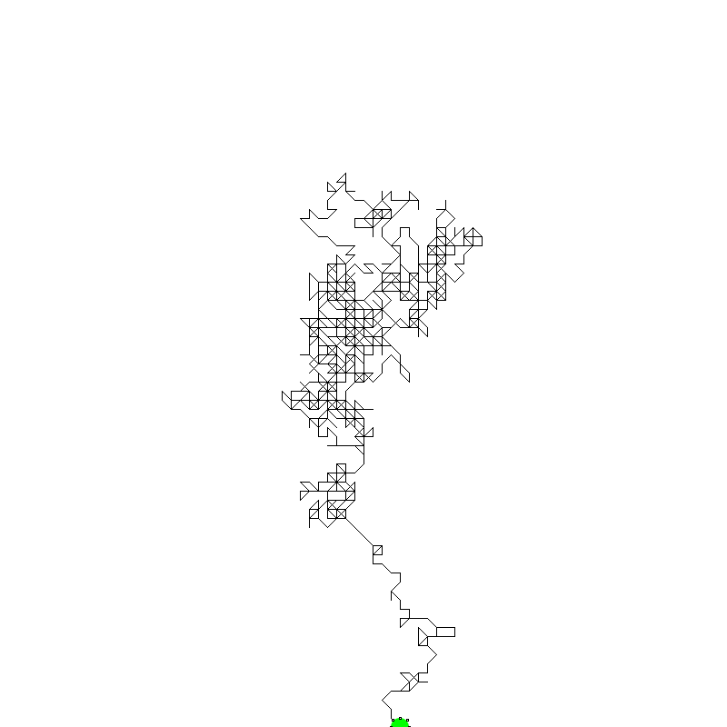

[Previous](./ans09-01.md) &nbsp;&nbsp;&nbsp;&nbsp;&nbsp;&nbsp;&nbsp;&nbsp;&nbsp;&nbsp;     [Exercise](../ex/ex09-02.md) &nbsp;&nbsp;&nbsp;&nbsp;&nbsp;&nbsp;&nbsp;&nbsp;&nbsp;&nbsp; [Next](./ans10-01.md)
# Exercise 09.02 - while-loop

Aim: 
- understand the while-loop

The while loop below will draw the trace of a randomly moving
agent (a random walk) onto the image. Provide the condition
for the while-loop, so that the random-walk stops when it reaches
the border of the image

```java
newImage("random-walk", "8-bit", 800, 800, 1);		// Create a new image of size 800x800 pixel
x = 400;											// Set the starting point to 400, 400
y = 400;			
makeOval(x,y,20,20);								// Draw a circle around the starting point
moveTo(x,y);										// Set the current drawing position to the starting point
Roi.setFillColor("green");							// Fill the circle with the color green
```
Your code starts after this line 
```java
while(x>=0 && x<800 && y>=0 && y<800) {				// while the random walk is within the image
```
Your code ends before this line 
```java
	x = x + 10 * round((2 * random) -1);			// increment or decrement x randomly by 10
	y = y + 10 * round((2 * random) -1);			// increment or decrement y randomly by 10
	Roi.move(x, y);									// Move the circle to the new position
	lineTo(x,y);									// draw a line from the current drawing position to the new position
	wait(10);										// wait 10 milliseconds so that we can see the circle move
}

```
<a href="image_1619640501262.png"></a>

The code below is for automatically checking the result. Please ignore it! 
```java
ok = (x<1 || x>=799 || y<1 || y>=799);
if (ok)
	showMessage("That's right. Great, you did it!");
else 
	showMessage("Your result is wrong! Please check your macro and try again!");
```
[Previous](./ans09-01.md) &nbsp;&nbsp;&nbsp;&nbsp;&nbsp;&nbsp;&nbsp;&nbsp;&nbsp;&nbsp;     [Exercise](../ex/ex09-02.md) &nbsp;&nbsp;&nbsp;&nbsp;&nbsp;&nbsp;&nbsp;&nbsp;&nbsp;&nbsp; [Next](./ans10-01.md)
