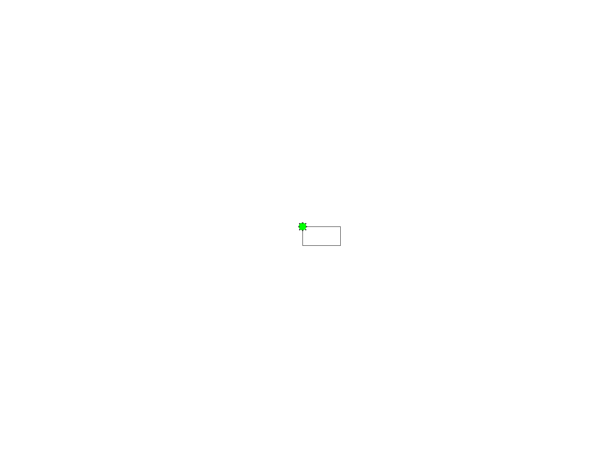

[Previous](./ans11-01.md) &nbsp;&nbsp;&nbsp;&nbsp;&nbsp;&nbsp;&nbsp;&nbsp;&nbsp;&nbsp;     [Exercise](../ex/ex11-02.md) &nbsp;&nbsp;&nbsp;&nbsp;&nbsp;&nbsp;&nbsp;&nbsp;&nbsp;&nbsp; [Next](./ans11-03.md)
# Exercise 11.02 - user defined functions

Aim: 
- understand variable scope and global variables

Turtle graphics consist of a turtle that is placed on an image
and that understands the commands
- ``forward(n)``
- ``right(a)``
- ``left(a)``

Complete the function ``right`` below then use the commands to draw a rectangle. 

Note: ``a -= 10`` is a short way to write ``a = a - 10``. It works the same way for ``+=``.

```java
var _X = 0;
var _Y = 0;
var _ANGLE = 0;
var _RADIUS = 20;
var _DELAY = 400;

newImage("turle graphics", "8-bit white", 1600, 1200, 1);
setForegroundColor(0,0,0);

initializeTurtle();
```
Your code starts after this line 
```java
forward(100);
right(90);
forward(50);
right(90);
forward(100);
right(90);
forward(50);
right(90);
```
Your code ends before this line 
```java
function initializeTurtle() {
	_X = getWidth() / 2;
	_Y = getHeight() / 2;
	moveTo(_X, _Y);
	makeOval(_X - (_RADIUS / 2), _Y - (_RADIUS / 2), _RADIUS, _RADIUS);
	Roi.setFillColor("green");
}

function forward(step) {
	_X += step * cos(_ANGLE * PI / 180);
	_Y += step * sin(_ANGLE * PI / 180);
	lineTo(_X, _Y);
	Roi.move(_X - (_RADIUS / 2), _Y - (_RADIUS / 2));
	wait(_DELAY);
}

function right(delta) {
```
Your code starts after this line 
```java
	_ANGLE += delta % 360;
```
Your code ends before this line 
```java
}

function left(delta) {
	_ANGLE -= delta % 360;
}
```
<a href="image_1619645693347.png"></a>
[Previous](./ans11-01.md) &nbsp;&nbsp;&nbsp;&nbsp;&nbsp;&nbsp;&nbsp;&nbsp;&nbsp;&nbsp;     [Exercise](../ex/ex11-02.md) &nbsp;&nbsp;&nbsp;&nbsp;&nbsp;&nbsp;&nbsp;&nbsp;&nbsp;&nbsp; [Next](./ans11-03.md)
