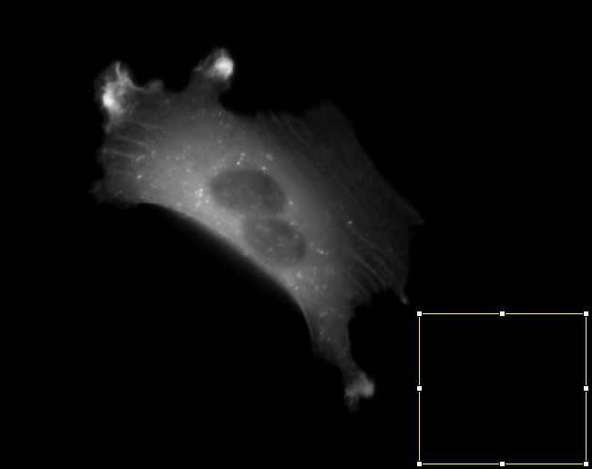

[Previous](./ans12-02.md) &nbsp;&nbsp;&nbsp;&nbsp;&nbsp;&nbsp;&nbsp;&nbsp;&nbsp;&nbsp;     [Exercise](../ex/ex13-01.md) &nbsp;&nbsp;&nbsp;&nbsp;&nbsp;&nbsp;&nbsp;&nbsp;&nbsp;&nbsp; [Next](./ans14-01.md)
# Exercise 13 - background correction on a stack

Aim: 
- apply some of the technics learned in the first part to 
correct the background in a time series. Learn how to pass
the value of a variable to a command that is called with ``run``.

Look at the time-series ``actine-stack.tif``. The base level
of the background varies from frame to frame. Fill in the
gaps in the macro below. It will correct the background in
the time-series, so that the flimmering when watching the
film will disapear.

The user should make a selection on the background before
starting the macro.

useful commands:
- ``nSlices`` - the number of slices in the stack
- ``setSlice(i)`` - set the current slice
- ``getStatistics(area, mean);``
- ``run("Select None");``
- ``run("Restore Selection");``
- ``run("Subtract...", "value=5 slice");``

Your code starts after this line 
```java
for (i=1; i<=nSlices; i++) {	// iterate over all frames of the time-series
    setSlice(i);			// set the current slice
    getStatistics(area, mean);			// get the mean intensity of the current selection (the variable mean will be set to it).
    run("Select None");					// remove the current selection before subtracting the mean from the image (otherwise it will just be subtracted from the selection).
    run("Subtract...", "value=" + mean + " slice");	// subtract the mean value of the background, measured on the current frame, from the current frame from the 
    run("Restore Selection");						// restore the original selection of a background region for the next iteration.
}
```
<a href="image_1619862487676.png"></a>

Your code ends before this line 

The code below is for automatically checking the result. Please ignore it! 
```java
run("Select None");	
imageId = getImageID();
makeRectangle(530, 30, 78, 430);
run("Plot Z-axis Profile");
plotId = getImageID();
Plot.getValues(x, y);
selectImage(imageId);
run("Select None");	
Array.getStatistics(y, min, max, mean, stdDev);
ok = (stdDev<1);
selectImage(plotId);
run("Close");
doCommand("Start Animation [\\]");
if (ok)
	showMessage("That's right. Great, you did it!");
else 
	showMessage("Your result is wrong! Please check your macro and try again!");
```

[Previous](./ans12-02.md) &nbsp;&nbsp;&nbsp;&nbsp;&nbsp;&nbsp;&nbsp;&nbsp;&nbsp;&nbsp;     [Exercise](../ex/ex13-01.md) &nbsp;&nbsp;&nbsp;&nbsp;&nbsp;&nbsp;&nbsp;&nbsp;&nbsp;&nbsp; [Next](./ans14-01.md)
