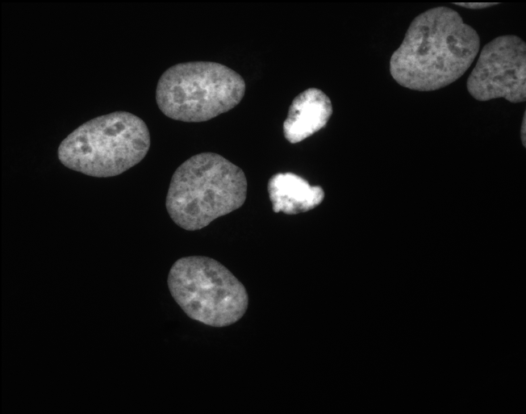
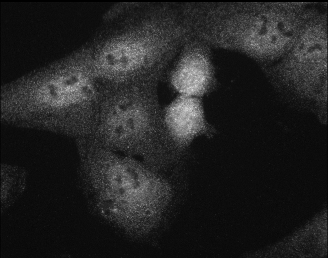

[Previous](./ans13-01.md) &nbsp;&nbsp;&nbsp;&nbsp;&nbsp;&nbsp;&nbsp;&nbsp;&nbsp;&nbsp;     [Exercise](../ex/ex14-01.md) &nbsp;&nbsp;&nbsp;&nbsp;&nbsp;&nbsp;&nbsp;&nbsp;&nbsp;&nbsp; [Next](./ans14-02.md)
# Exercise 14.01 - Open related files

Aim: 
- learn how to open related images, by using string operations on the filenames.

The folder ``images/14`` contains a number of images of cells. The images 
come in pairs belonging together. One channel contains the dapi-staining
the other the rhodamine. 

Let the user select a dapi-image. The macro should then open the dapi image and
the corresponding rhodamine image.

Useful commands:
- ``open()``					The ``open`` command without parameter opens a file-dialog that lets the user select an image. The selected image will be opened in ImageJ.
- ``File.directory``			The directory from which the last file has been opened.
- ``File.name``					The name of the last file that has been opened
- ``replace(string, old ,new)``	Replaces all occurences of the substring ``old`` in ``string`` by ``new`` and returns the result.
- ``open(path)``				Opens the image stored under ``path`` in the filesystem.

Your code starts after this line 

```java
open();
path = File.directory;
imageDAPI = File.name;
imageRHOD = replace(imageDAPI, "dapi", "rhod");
open(path + imageRHOD);
```
<a href="image_1619881767781.png"></a>
<a href="image_1619881768342.png"></a>

Your code ends before this line

The code below is for automatically checking the result. Please ignore it! 
```java
ok = (nImages == 2);
ok = ok && (isOpen(imageDAPI));
ok = ok && (isOpen(imageRHOD));
if (ok)
	showMessage("That's right. Great, you did it!");
else 
	showMessage("Your result is wrong! Please check your macro and try again!");
```
[Previous](./ans13-01.md) &nbsp;&nbsp;&nbsp;&nbsp;&nbsp;&nbsp;&nbsp;&nbsp;&nbsp;&nbsp;     [Exercise](../ex/ex14-01.md) &nbsp;&nbsp;&nbsp;&nbsp;&nbsp;&nbsp;&nbsp;&nbsp;&nbsp;&nbsp; [Next](./ans14-02.md)
