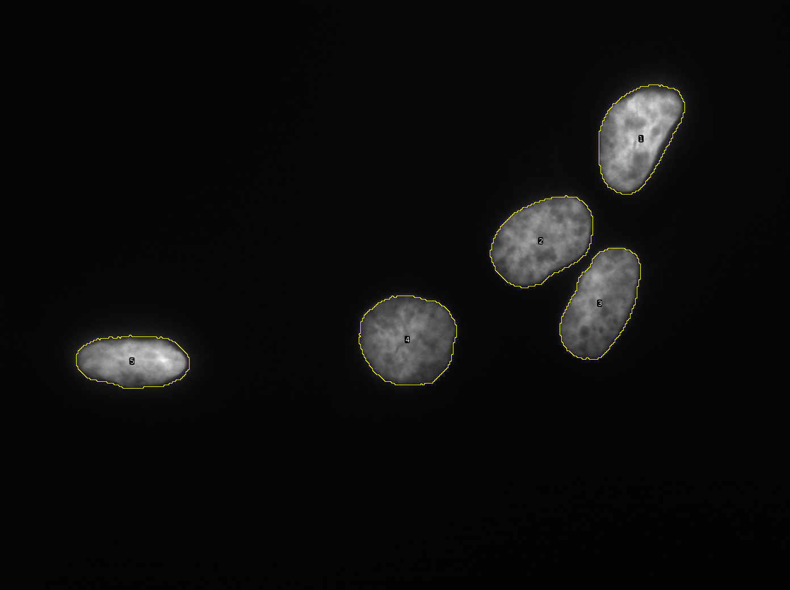

[Previous](./ans15-01.md) &nbsp;&nbsp;&nbsp;&nbsp;&nbsp;&nbsp;&nbsp;&nbsp;&nbsp;&nbsp;     [Exercise](../ex/ex16-01.md) &nbsp;&nbsp;&nbsp;&nbsp;&nbsp;&nbsp;&nbsp;&nbsp;&nbsp;&nbsp; [Next](./ans17-01.md)
# Exercise 16.1 - Separate nuclei by using a binary watershed

Aim: 
- learn how to separate objects touching each other

The nuclei in the images in the folder ``images/16`` need to be analyzed. However
when simply using a threshold and the particle analyzer, the nuclei will not be separtated
from each other. 

Implement the follwoing protocol in the macro below:

1. Create a tmp image by scaling down the current image by ``1/factor``, using bilinear interpolation
1. Apply the ``Huang`` auto-threshold (set the threshold and convert to a mask).
1. Fill holes to avoid wrong separations by the following watershed
1. Run the binary watershed.
1. Create a new tmp image by scaling the small image up by ``factor`` using bilinear interpolation
1. Apply the ``Huang`` auto-threshold (because of the interpolation the image is not a mask anymore)
1. Reset the roi-manager
1. Use the particle analyzer to detect the nuclei and to add them to the roi-manager
1. Close the tmp-images
1. Display the rois in the roi-manager on the input image

Your code starts after this line 
```java
SCALE_FACTOR = 3;
run("Scale...", "x="+(1.0/SCALE_FACTOR)+" y="+(1.0/SCALE_FACTOR)+" interpolation=Bilinear create title=small_tmp");
setAutoThreshold("Huang dark");

run("Convert to Mask");
run("Fill Holes");
run("Watershed");

run("Scale...", "x="+SCALE_FACTOR+" y="+SCALE_FACTOR+" interpolation=Bilinear create title=big_tmp");
setAutoThreshold("Huang");
roiManager("Reset");
run("Analyze Particles...", "size=0-Infinity circularity=0.00-1.00 show=Nothing exclude add");
selectWindow("small_tmp");
close();
selectWindow("big_tmp");
close();
roiManager("Show All");
```
Your code ends before this line

The code below is for automatically checking the result. Please ignore it! 
```java
ok = (nImages>0);
ok = ok && roiManager("count")>2;
if (ok)
	showMessage("That's right. Great, you did it!");
else 
	showMessage("Your result is wrong! Please check your macro and try again!");
```
<a href="image_1619887836906.png"></a>

[Previous](./ans15-01.md) &nbsp;&nbsp;&nbsp;&nbsp;&nbsp;&nbsp;&nbsp;&nbsp;&nbsp;&nbsp;     [Exercise](../ex/ex16-01.md) &nbsp;&nbsp;&nbsp;&nbsp;&nbsp;&nbsp;&nbsp;&nbsp;&nbsp;&nbsp; [Next](./ans17-01.md)
