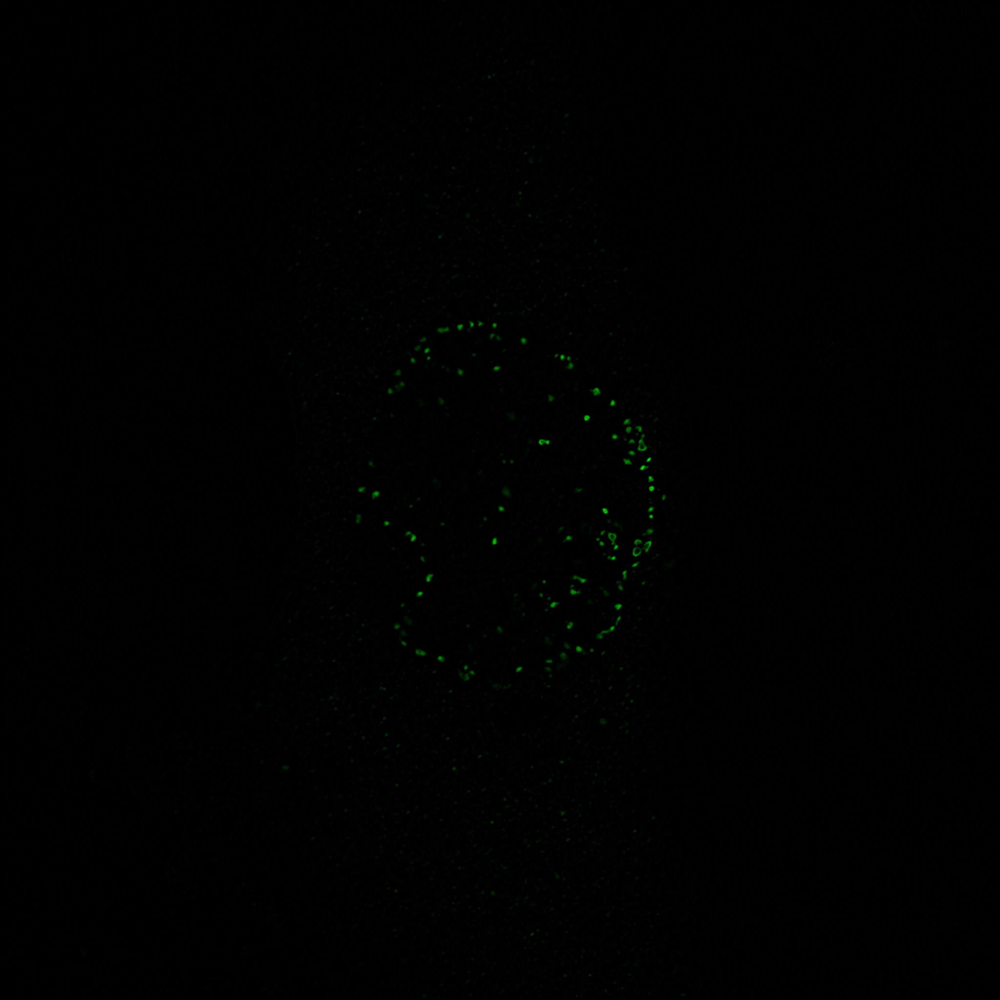
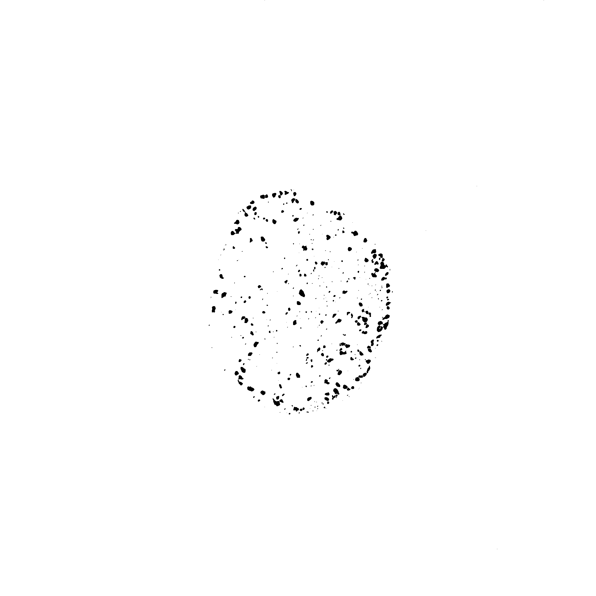
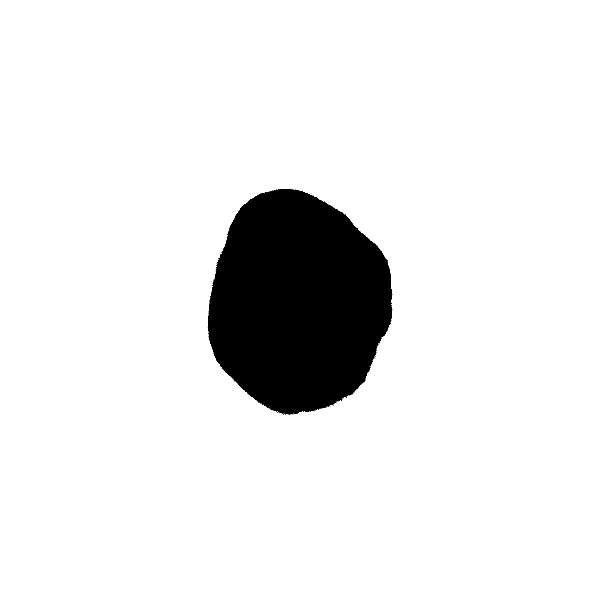

[Previous](./ans21-01.md) &nbsp;&nbsp;&nbsp;&nbsp;&nbsp;&nbsp;&nbsp;&nbsp;&nbsp;&nbsp;     [Exercise](../ex/ex21-02.md) &nbsp;&nbsp;&nbsp;&nbsp;&nbsp;&nbsp;&nbsp;&nbsp;&nbsp;&nbsp; [Next](./ans21-03.md)
# Exercise 21 - Measure the distance of spots to the border of the nucleus 
## Exercise 21.2 - Remove spots outside the nucleus
Aims:
- threshold images and create binary masks
- use the nucleus mask to remove spots outside the nucleus

Use the ``DoG`` function of the last exercise on the green channel of the image in
``images/21``! Apply an auto-threshold (triangle) and create a binary mask and apply a binary 
watershed to separate touching spots!

Apply an auto-threshold on the blue-channel and create a binary mask!

Combine the two binary masks using the Image Calculator with the ``and``-operation to only
keep common areas! Do not close the mask of the nucleus in the macro, we are still going to need 
it in the next step.

```java
inputImageID = getImageID();
DoG(1.4, 3);
```
<a href="image_1619976542186.png"></a>

Your code starts after this line 
```java
setAutoThreshold("Triangle dark");
run("Convert to Mask");
run("Watershed");
spotsMaskID = getImageID();
selectImage(inputImageID);
run("Duplicate...", "duplicate channels=2-2");
setAutoThreshold("Triangle dark");
run("Convert to Mask");
nucleusMaskID = getImageID();
imageCalculator("and", spotsMaskID, nucleusMaskID);
```
<a href="image_1619976546183.png"></a>
<a href="image_1619976546541.png"></a>

Your code ends before this line 
```java

function DoG(sigma1, sigma2) {
	run("Duplicate...", " ");
	bigBlurID = getImageID();	
	run("Duplicate...", " ");
	smallBlurID = getImageID();	
	run("Gaussian Blur...", "sigma="+sigma1);
	selectImage(bigBlurID);
	bigBlurTitle = getTitle();
	run("Gaussian Blur...", "sigma="+sigma2);
	imageCalculator("subtract", smallBlurID, bigBlurID);
	close(bigBlurTitle);
}
```
[Previous](./ans21-01.md) &nbsp;&nbsp;&nbsp;&nbsp;&nbsp;&nbsp;&nbsp;&nbsp;&nbsp;&nbsp;     [Exercise](../ex/ex21-02.md) &nbsp;&nbsp;&nbsp;&nbsp;&nbsp;&nbsp;&nbsp;&nbsp;&nbsp;&nbsp; [Next](./ans21-03.md)
