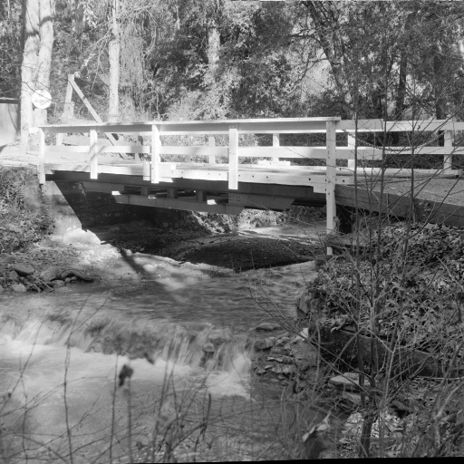

[Previous](./ex03-02.md) &nbsp;&nbsp;&nbsp;&nbsp;&nbsp;&nbsp;&nbsp;&nbsp;&nbsp;&nbsp;     [Answer](../ans/ans03-03.md) &nbsp;&nbsp;&nbsp;&nbsp;&nbsp;&nbsp;&nbsp;&nbsp;&nbsp;&nbsp; [Next](./ex03-04.md)

# Exercise 03.03 - Strings - Concatenation 3
Aims: 
- understand string-concatenation

The command ``Combine...`` takes two images and combines them
in the same image window. You can call it using the run command:
> ``run("Combine...", options)``. 

`options` is a string of the form:
> ``"stack1=[<title1>] stack2=[<title2>]"``

`<title1>` and `<title2>` must be replaced by the actual titles of the images. 
Given the two variables `title1` and `title2`, construct the options string using string-concatenation. 

```java
run("Boats (356K)");
run("Bridge (174K)");
title1 = "boats.gif";
title2 = "bridge.gif";

```
<a href="image_1619428389705.png"></a>
<a href="image_1619428389959.png"></a>

Your code starts after this line 
```java
options = 
```
Your code ends before this line 
```java

run("Combine...", options);

```
<a href="image_1619428390284.png"></a>

The code below is for automatically checking the result. Please ignore it! 
```java
res = getTitle();
"\\Clear";
print(options);
if (res=="Combined Stacks") 
	showMessage("That's right. Great, you did it!");
else 
	showMessage("Your result is wrong! Please check your macro and try again!");
```

[Previous](./ex03-02.md) &nbsp;&nbsp;&nbsp;&nbsp;&nbsp;&nbsp;&nbsp;&nbsp;&nbsp;&nbsp;     [Answer](../ans/ans03-03.md) &nbsp;&nbsp;&nbsp;&nbsp;&nbsp;&nbsp;&nbsp;&nbsp;&nbsp;&nbsp; [Next](./ex03-04.md)
