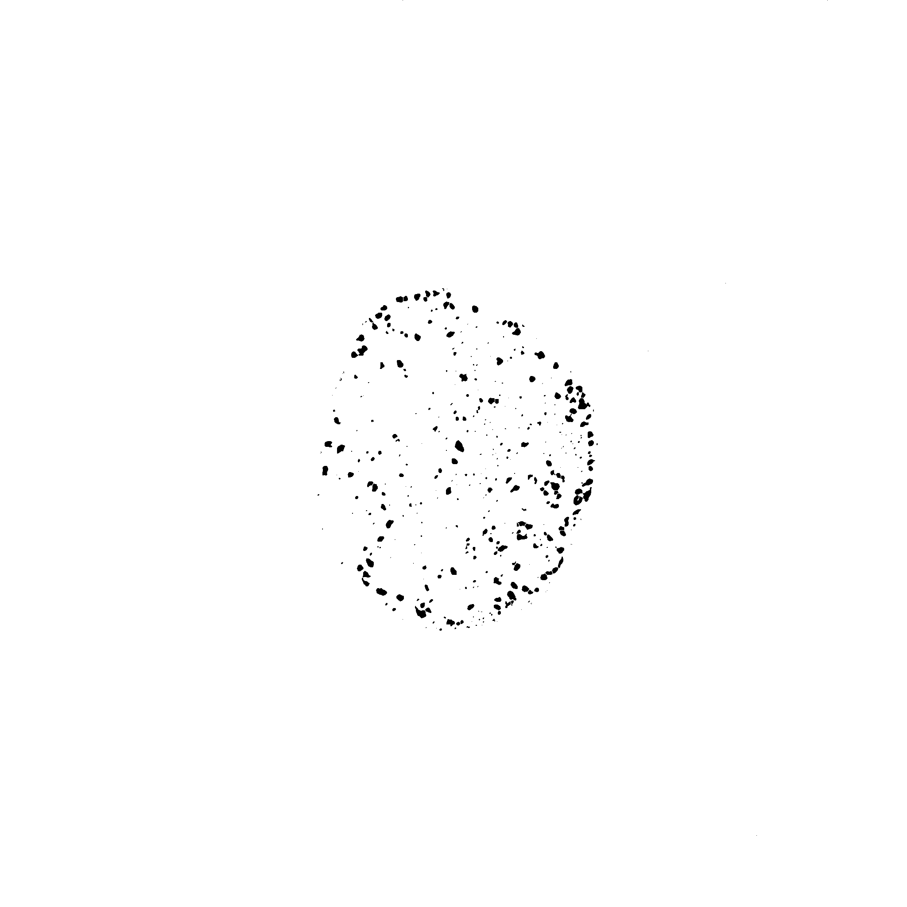
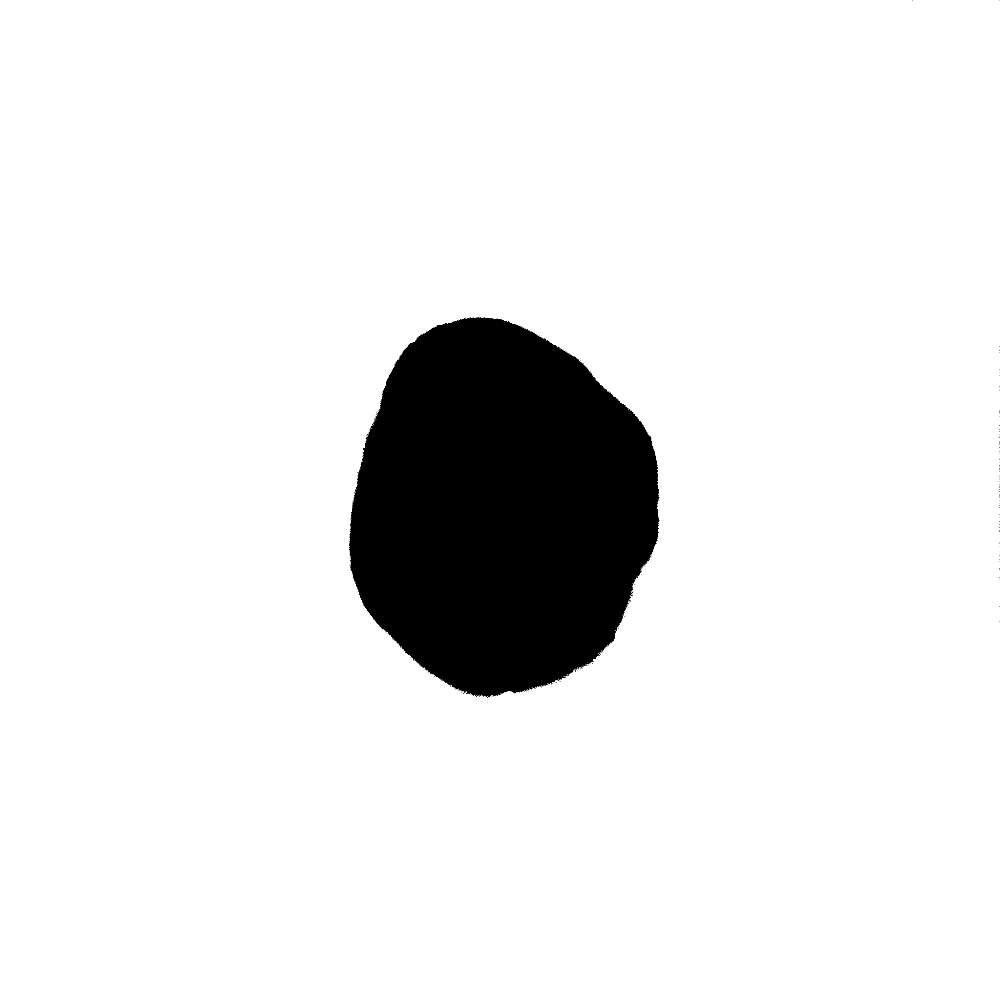

[Previous](./ex21-02.md) &nbsp;&nbsp;&nbsp;&nbsp;&nbsp;&nbsp;&nbsp;&nbsp;&nbsp;&nbsp;     [Solution](../ans/ans21-03.md) &nbsp;&nbsp;&nbsp;&nbsp;&nbsp;&nbsp;&nbsp;&nbsp;&nbsp;&nbsp; [Next](./ex22-01.md)
# Exercise 21 - Measure the distance of spots to the border of the nucleus 
## Exercise 21.3 - Measure the distance of the spots to the border
Aims:
- learn to use distance transforms
- create rois on one image and measure on another

A distance transform takes a mask as input and outputs an image in which the pixel values represent the 
shortest distance from the pixel to the border of the object. 

Continue the code from the last exercise! Apply the ``Exact Euclidean Distance Transform`` to the nucleus
mask. Use the particle analyzer to add the spots to the roi-manager and eliminate very small objects in 
the same time. Make sure the min. intensity is measured (``Set Measurements``). Activate the EDT image and 
measure the rois. 

```java
roiManager("reset");
inputImageID = getImageID();
inTitle = getTitle();
DoG(1.4, 3);

setAutoThreshold("Triangle dark");
run("Convert to Mask");
run("Watershed");
spotsMaskID = getImageID();
selectImage(inputImageID);
run("Duplicate...", "duplicate channels=2-2");
setAutoThreshold("Triangle dark");
run("Convert to Mask");
nucleusMaskID = getImageID();
imageCalculator("and", spotsMaskID, nucleusMaskID);

```
<a href="image_1619992300956.png"></a>
<a href="image_1619992301287.png"></a>

your code starts after this line 
```java


```
your code ends before this line 
```java

function DoG(sigma1, sigma2) {
	run("Duplicate...", " ");
	bigBlurID = getImageID();	
	run("Duplicate...", " ");
	smallBlurID = getImageID();	
	run("Gaussian Blur...", "sigma="+sigma1);
	selectImage(bigBlurID);
	bigBlurTitle = getTitle();
	run("Gaussian Blur...", "sigma="+sigma2);
	imageCalculator("subtract", smallBlurID, bigBlurID);
	close(bigBlurTitle);
}
```
[Previous](./ex21-02.md) &nbsp;&nbsp;&nbsp;&nbsp;&nbsp;&nbsp;&nbsp;&nbsp;&nbsp;&nbsp;     [Solution](../ans/ans21-03.md) &nbsp;&nbsp;&nbsp;&nbsp;&nbsp;&nbsp;&nbsp;&nbsp;&nbsp;&nbsp; [Next](./ex22-01.md)
